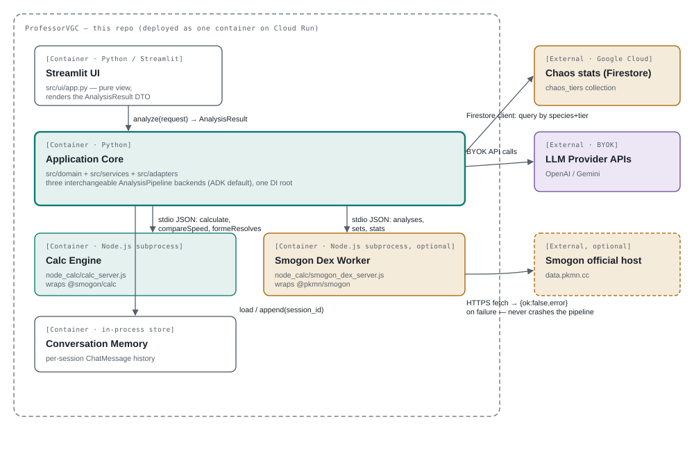

# ProfessorVGC

[](https://github.com/Huarada/professor-VGC/actions/workflows/ci.yml)

A **Clean-Architecture** engine that analyzes Pokémon VGC battles by combining a
**deterministic** damage-calc layer (`@smogon/calc` via Node IPC) with a
**probabilistic** metagame feed (Smogon *Chaos* usage stats) and two LLM stages,
orchestrated with **Google ADK** (Agent Development Kit) by default — **LangChain**
and a hand-rolled **native** pipeline remain available as interchangeable
backends — for selection and natural-language coaching (bring your own key).

The guiding principle: **the LLM explains ground truth; it never invents it.**
Every number it may cite — damage, speed order, KO threats, Protect / switch /
speed-control options — is computed in code first, under the battle state at
the moment of each move (weather, terrain, screens, HP, status, items), and
handed to the LLM as typed evidence.

## How well does it match real games?

Measured, not asserted — against what **actually happened** in real public
Showdown games, not against the pipeline's own numbers.

**The external truth is the battle log.** An independent reader
([`observed_damage.py`](scripts/faithfulness_benchmark/observed_damage.py),
which imports nothing from `src/`) takes the damage each hit really did from
the raw `-damage` lines. Both the AI's damage claims and the engine's projected
damage ranges are checked against it, on 40 recent public
`gen9championsvgc2026regmb` replays.

**Agreement is judged within a tolerance band, not as an exact match:** ±2
percentage points because the log shows HP rounded to whole percents, plus a
relative **±5%** because a real Pokémon's EVs/nature differ from the one spread
the projection assumes. Every rate carries a **95% confidence interval**
(Wilson), and the comparison an exact interval for its odds ratio.

| Checked against the real log (±2pp ±5%) | Rate (95% CI) |
|---|---|
| AI damage claims — **A**: the grounded pipeline | **59.9% (55.0–64.7%)**, 229/382 |
| AI damage claims — **B**: the same LLM given only the raw log | 51.1% (46.0–56.1%), 191/374 |
| A vs B | odds ratio **1.43 (1.06–1.93)**, p = 0.016 |
| Claims about hits that never happened | A: 18 · B: 57 |
| Engine projection contains the real damage (non-KO hits, no LLM) | **52.1% (46.8–57.3%)**, 176/338 |
| Engine projection reaches a real KO | 84.4% (78.6–88.8%), 162/192 |
| Engine misses explained by EV/nature variance alone | 68.6% (61.7–74.7%), 131/191 |

> **Data note (ADR-035).** The engine rows use the official September 2026 VGC
> usage data. The AI-claim rows (A vs B) were measured before the bundled
> `data/chaos` dumps were found to be singles (BSS) stats, so Condition A's
> assumed spreads came from singles data; those two rows will be re-measured
> with the official VGC data. With the singles data the engine row was 47.9%.

The conclusion does not hinge on the tolerance chosen — the same claims
re-scored:

| Relative tolerance | A (95% CI) | B (95% CI) | Odds ratio (95% CI) | p |
|---|---|---|---|---|
| 0% (±2pp only) | 56.8% (51.8–61.7%) | 49.5% (44.4–54.5%) | 1.34 (1.00–1.81) | 0.049 |
| **5%** | **59.9% (55.0–64.7%)** | **51.1% (46.0–56.1%)** | **1.43 (1.06–1.93)** | **0.016** |
| 10% | 63.4% (58.4–68.0%) | 52.9% (47.9–57.9%) | 1.54 (1.14–2.08) | 0.004 |
| 15% | 67.3% (62.4–71.8%) | 55.3% (50.3–60.3%) | 1.66 (1.22–2.25) | 0.0008 |

**What it means.**

- **Grounding helps, modestly.** About 9 points more claims consistent with
  the log, significant at every tolerance, and three times fewer invented hits.
  It is not the 80× an earlier, circular benchmark suggested.
- **The ceiling is the assumed sets, not the engine.** Unrevealed
  EVs/natures/items/abilities are backed off the single most-used Chaos set.
  ~70% of the engine's misses fit some other EV/nature spread; the rest come
  from unrevealed abilities or items (e.g. Liquid Voice, Scrappy) or species
  without usage data. Projected damage is a baseline; the log's observed
  damage is what happened.
- **Pool runs over distinct games.** LLM output varies from run to run: each
  run of 20 games alone was *not* significant at ±5% (p = 0.088 and 0.10).
  Results are reported pooled over different games, with intervals.

Methodology, every run, the sensitivity analysis, the EV/nature envelope and
the bias audit: [`scripts/faithfulness_benchmark/README.md`](scripts/faithfulness_benchmark/README.md)
("Round 6"); decisions: ADR-033 and ADR-034 in [`ADR.md`](ADR.md).

<details>
<summary>Earlier rounds: faithfulness to the evidence (circular for damage)</summary>

The first benchmark rounds used hand-authored fixtures and checked each claim
against the pipeline's **own projected ranges** — the very numbers Condition A
was given. That measures faithfulness to the evidence, not correctness, and
judges Condition B against assumptions it never saw, which is why its odds
ratios were so large:

| Provider / model | Orchestrator | Grounded | Naive | Odds ratio | p |
|---|---|---|---|---|---|
| OpenAI gpt-4o-mini | native | 92.0% | 12.6% | 80.0 | <0.0001 |
| OpenAI gpt-4o-mini | adk | 72.2% | 14.1% | 15.23 | <0.0001 |
| OpenAI gpt-4o-mini | langchain | 73.8% | 14.1% | 17.14 | <0.0001 |
| Gemini 3.5-flash | adk (default) | 73.3% | 11.0% | 22.27 | 2.70e-15 |

Use these only as evidence that the explanation repeats its evidence
faithfully; cite the real-game table above for correctness.

</details>

### Reproduce

```bash
python -m scripts.faithfulness_benchmark.replay_corpus --count 40              # public replays -> data/replays/cache (git-ignored)
python -m scripts.faithfulness_benchmark.chaos_corpus                          # official VGC usage tiers -> data/chaos-cache (git-ignored)
python -m scripts.faithfulness_benchmark.run_engine_calibration --chaos data/chaos-cache  # engine vs real damage, no LLM
python -m scripts.faithfulness_benchmark.run_log_grounded --provider openai --chaos data/chaos-cache --limit 20             # games 1-20 (API calls)
python -m scripts.faithfulness_benchmark.run_log_grounded --provider openai --chaos data/chaos-cache --limit 20 --offset 20 # games 21-40
python -m scripts.faithfulness_benchmark.rescore_log_grounded out/RUN1.json out/RUN2.json --relative-tolerance 0.05  # pool + any band, no API calls
```

`--relative-tolerance` sets the band (default 0.05); `rescore_log_grounded`
refuses to pool runs that share a game.

## Pipeline

```
replay JSON / log / URL + question
   │  LogParser.parse                     ← deterministic: rosters, ordered timeline,
   ▼                                        per-move BattleSnapshot (field, HP, status, items)
GameState
   │  SelectionStrategy                   ← 1st AI (memory-aware), cross-side matchups only
   ▼
SelectionPlan (focus species + matchups)
   │  GroundTruthAssembler                ← shared by every backend
   ├─▶ MetaStatsProvider (Chaos)            likely sets, threats (all in-play Pokémon)
   ├─▶ MatchupEvaluator (@smogon/calc)      field-aware damage + speed verdicts
   ├─▶ TurnReplaySimulator                  per move: projected vs logged damage, speed,
   │                                        alternatives into every target, KO threats,
   │                                        Protect / switch / speed-control options
   └─▶ StrategyKnowledgeProvider (Smogon)   archetypes, teammates, official analyses
   ▼
AnalysisEvidence
   │  explanation                         ← 2nd AI (memory-aware, ground-truth-locked prompt;
   ▼                                        agent backends may call read-only EvidenceTools)
AnalysisResult (UI DTO)
```

## Layers

| Layer | Package | Rule |
|-------|---------|------|
| Domain (core) | `src/domain` | Pydantic models (value objects frozen), Protocol ports, exceptions. Zero framework deps. |
| Adapters (infra) | `src/adapters` | Showdown log reader, Node calc IPC, Chaos (Firestore), Smogon, OpenAI/Gemini/LangChain/ADK, embeddings, memory, prompts. |
| Services (use cases) | `src/services` | The three orchestrators, the shared `GroundTruthAssembler`, selection, per-move simulation, decision review, DI composition root. Depend only on Protocols. |
| Presentation | `src/ui` | Streamlit. Pure view — calls a use case, renders a DTO. |
| Polyglot subsystem | `node_calc` | Node workers exposing `@smogon/calc` and `@pkmn/smogon` over stdin/stdout. |

Dependency Inversion is enforced everywhere: `services` and `ui` never import
`adapters`; concrete adapters are wired in `src/services/container.py` and
nowhere else.

## Orchestration (Google ADK / LangChain / native)

The orchestration technology is a **pluggable infrastructure choice** behind the
`AnalysisPipeline` port. Three interchangeable backends implement it:

| Backend | Class | How the LLM stages run |
|---------|-------|------------------------|
| `adk` (default) | `AdkAnalysisOrchestrator` | Google **ADK** `LlmAgent`s: a schema-constrained (`output_schema`), tool-less agent for selection; a bounded tool-calling agent for explanation. |
| `langchain` | `LangChainAnalysisOrchestrator` | **LCEL** chains: `RunnableLambda(build_messages) \| chat_model \| JsonOutputParser` for selection, a `langchain.agents.create_agent` tool-calling agent for explanation. |
| `native` | `AnalysisService` | Direct provider SDK calls through the `LLMProvider` port. |

Select at runtime via `PROFESSORVGC_ORCHESTRATOR=adk|langchain|native` or the UI
dropdown. The LLM *vendor* (`PROFESSORVGC_DEFAULT_PROVIDER=openai|gemini`) is a
fully independent choice — any backend works with either key.

All three backends receive the same injected evidence stage
(`GroundTruthAssembler`, `src/services/ground_truth.py`), so switching
orchestration technology never changes a single damage roll — a parity test
pins this. The agents' on-demand tools (`damage_calc`, `chaos_meta_stats`,
`smogon_strategy`) are one framework-agnostic core
(`src/adapters/llm/evidence_tools.py`), wrapped per framework; every parameter
is required because Gemini's function-calling schema rejects defaults.

## Setup

```bash
# 1. Python core (3.10+)
python -m pip install -r requirements.txt
# — or, equivalently, the packaging-metadata path (also gives mypy/pytest):
#   python -m pip install -e ".[dev]"

# 2. Node calc engine (Node 20+)
cd node_calc && npm install && cd ..

# 3. Configuration (bring your own key)
cp .env.example .env      # then fill PROFESSORVGC_OPENAI_API_KEY or PROFESSORVGC_GEMINI_API_KEY
```

Verify the Node engine standalone:

```bash
cd node_calc && npm run smoke      # prints a Garchomp→Sinistcha calc as JSON
```

## Run

```bash
streamlit run src/ui/app.py
```

Paste a Showdown replay URL, its JSON, or the raw battle log, and ask a
question. Gemini models must be 3.5 or newer (enforced at startup).

## Regulation controller

Pick which regulation an analysis uses — in the sidebar, or with
`PROFESSORVGC_REGULATION`:

| Value | Behavior |
|---|---|
| `auto` (default) | The replay's own regulation (Bo3 uses its Bo1 data); older regulations of the same game may fill gaps. |
| `mb` / `mc` / a format id | Pinned: usage data, Smogon sets/analyses and the Pokemon the answer may mention come from that regulation **only** — no fallback to any other — and a replay from another regulation is refused. |

In every mode a requested format is never swapped for "the newest" one, the
agent tools are bound to the analysis's regulation, evidence about other
Pokemon is filtered to the regulation's legal species, and the answer is
checked deterministically: a Pokemon from outside the regulation (e.g. one that
only exists in Reg M-C, in a Reg M-B analysis) triggers one automatic
correction and, if it persists, a visible warning. See ADR-035.

## Customizing the UI (optional)

The default theme (light "battle notebook" sky-blue, no external assets)
works with nothing configured. To customize it without touching code: drop
an image into [`src/ui/assets/backgrounds/`](src/ui/assets/backgrounds/)
(`page.*` for the whole app, `battle-stage.*` for the battle panel) or an
audio file into [`src/ui/assets/audio/`](src/ui/assets/audio/)
(`theme.mp3`/`.mp4`/`.m4a`/`.wav`/`.ogg`, with its own on/off toggle in the
sidebar). Each folder's own README covers size/format guidance.

## Official Smogon data (optional)

Set `PROFESSORVGC_USE_SMOGON_DEX=true` to pull Smogon's official analyses/sets/stats via
`@pkmn/smogon` at runtime (Node deps installed by `npm install` in `node_calc`).
Strategies then use official analyses (with the Chaos data as fallback), and
team-improvement questions use official sets + usage stats. See DATA.md.

### Semantic strategy retrieval (optional, needs the above)

Set `PROFESSORVGC_USE_SEMANTIC_STRATEGY=true` to rank Smogon's official analysis
passages against the user's actual question via embeddings, instead of always
using the first available format's overview. Reuses whichever LLM provider key
is already configured. A lightweight implementation (no vector database):
embeddings + in-memory cosine similarity over the handful of paragraphs Smogon
publishes per species. See ADR-027.

## Chaos data

The running app reads Chaos usage stats **exclusively from Google Cloud
Firestore** — set `PROFESSORVGC_FIRESTORE_PROJECT_ID` (and, once, populate the
database — see DATA.md's "Firestore: the app's ONLY Chaos data source"
section). There is no local-file fallback in the app; the benchmark tooling can
read the same dumps from `data/chaos/` offline (`--chaos local`, read-only).

Populate Firestore from a real Smogon Chaos dump (a trimmed sample lives in
`sample_data/`) with:

```bash
python -m scripts.migrate_chaos_to_firestore --project-id YOUR_PROJECT
# or, directly from Smogon's own site, no local file needed:
python -m scripts.sync_smogon_chaos_to_firestore --project-id YOUR_PROJECT
```

The adapter converts Chaos's `Nature:e/e/e/e/e/e` (EVs ÷ 8) encoding back to
real 0-252 EVs and keeps only the Top-N per category to stay ~1 KB per prompt.

## Tests

```bash
pytest -q          # in-memory fakes; no network or API keys required
mypy src           # strict — the same check CI runs on every PR
```

Neither Node nor an LLM/LangChain/ADK install is required for a green `pytest`
run — every test either uses an in-memory fake or skips itself cleanly when
that optional piece isn't present. With Node set up, the calc-engine
integration tests (`test_calc_engine_*.py`) run against the real `@smogon/calc`
subprocess, as [`.github/workflows/ci.yml`](.github/workflows/ci.yml) does on
every PR (Python 3.10 and 3.12).

## Extending

- **New LLM vendor:** add an adapter in `src/adapters/llm/`, register it in
  `Container.build_llm` / `build_chat_model`. Nothing else changes.
- **New calc backend (Rust/HTTP/...):** implement `CalcEngineAdapter` and swap
  it in the container. Domain and services are untouched.
- **New orchestration backend:** implement `AnalysisPipeline` owning only
  selection + explanation, take the shared `GroundTruthAssembler`, register it
  in `Container.build_pipeline` and add it to the parity test.
- **New evidence for the LLM:** compute it once in `GroundTruthAssembler` as a
  typed field; every backend gets it.
- **New battle-log fact:** add a handler to the matching group in
  `src/adapters/parsers/showdown_log/handlers/`.
- **New Chaos storage backend:** implement `ChaosRepositoryLike` (reusing the
  shared `ChaosTierIndex`) and wire it in `Container.chaos_repository`.

## Architecture diagram

C4 model, built from source (not generated). The full five-view walkthrough
(System Context, Containers, Components, a Dynamic view of the tool-calling
loop, and the stage-by-stage data flow) lives in
[`docs/architecture-blueprint.html`](docs/architecture-blueprint.html).

**Containers — how the LLM provider connects to the backend, Firestore, and the UI:**



**Components — the separation of responsibilities (Dependency Inversion in practice):**


## Contributing, security and license

- How to set up, branch, commit and open a PR: [`CONTRIBUTING.md`](CONTRIBUTING.md).
- Architecture invariants and extension points (for humans and AI assistants):
  [`.claude/CLAUDE.md`](.claude/CLAUDE.md); decisions and trade-offs: [`ADR.md`](ADR.md).
- Reporting a vulnerability: [`SECURITY.md`](SECURITY.md).
- Licensed under the [Apache License 2.0](LICENSE).
